<div align="center">


[](https://git.io/typing-svg)



<p>
  Informatics Engineering undergraduate at <b>Institut Teknologi Sumatera</b><br>
  and Full-stack Developer at <b>PT. Tunas Link Indonesia</b>.
</p>

[](https://github.com/raihantririzqiwibowo)
[](https://github.com/raihantririzqiwibowo?tab=followers)
[](https://github.com/raihantririzqiwibowo)

</div>

## 👨‍💻 About Me

```yaml
name: Raihan Tri Rizqi Wibowo
location: Bandar Lampung, Indonesia
education: Informatics Engineering — ITERA
role: Full-stack Software Engineer & Architect
focus: [Scalable Web Apps, Backend Systems, Infrastructure]
currently_building: ISP Billing & Warehouse Management Systems
```

- 🚀 Building production systems with **Next.js** and **Go**
- ⚙️ Experienced in ISP billing, payment gateway, and OLT hardware automation
- 📦 Architecting warehouse and batch inventory management solutions
- 🐳 Managing deployments with Docker, Nginx, PM2, and Linux
- 🤝 Open to Software Engineer opportunities and collaborations

## 🛠️ Tech Stack

<div align="center">

### Core


### Infrastructure & Tools


</div>

## 💼 Experience Highlights

### Full-stack Developer · PT. Tunas Link Indonesia

`October 2024 — Present`

- Architecting a batch inventory system for warehouse stock and logistics
- Maintaining an ISP billing platform with automated invoicing
- Integrating ZTE and FiberHome OLT hardware through Go services
- Implementing payment gateway automation and financial reporting
- Operating production infrastructure with Docker, Nginx, PM2, and Linux

### Head of Technical Division · Informatika ITERA 2025

`December 2025 — January 2026`

- Led technical analysts and maintained secure student platforms
- Built user-friendly interfaces with Next.js
- Provided infrastructure support and technical troubleshooting

## 🏆 Achievements & Certifications

- 🥇 **1st Place** — IT Software Solution for Business, LKS Lampung Tengah 2023
- 🥈 **2nd Place** — IT Software Solution for Business, LKS Provinsi Lampung 2023
- 🎓 **Belajar Machine Learning untuk Pemula** — Dicoding Indonesia, 2026
- 🎓 **Memulai Pemrograman dengan Dart** — Dicoding Indonesia, 2024

## 📊 GitHub Analytics

<div align="center">
  <picture>
    <source
      srcset="https://github-readme-stats.vercel.app/api?username=raihantririzqiwibowo&amp;show_icons=true&amp;theme=github_dark&amp;hide_border=true&amp;rank_icon=github"
      media="(prefers-color-scheme: dark)"
    />
    <source
      srcset="https://github-readme-stats.vercel.app/api?username=raihantririzqiwibowo&amp;show_icons=true&amp;theme=default&amp;hide_border=true&amp;rank_icon=github"
      media="(prefers-color-scheme: light), (prefers-color-scheme: no-preference)"
    />
    
  </picture>
  <picture>
    <source
      srcset="https://github-readme-stats.vercel.app/api/top-langs/?username=raihantririzqiwibowo&amp;layout=compact&amp;theme=github_dark&amp;hide_border=true"
      media="(prefers-color-scheme: dark)"
    />
    <source
      srcset="https://github-readme-stats.vercel.app/api/top-langs/?username=raihantririzqiwibowo&amp;layout=compact&amp;theme=default&amp;hide_border=true"
      media="(prefers-color-scheme: light), (prefers-color-scheme: no-preference)"
    />
    
  </picture>


</div>

## 🐍 Contribution Snake

<div align="center">

<picture>
  <source media="(prefers-color-scheme: dark)" srcset="https://raw.githubusercontent.com/raihantririzqiwibowo/raihantririzqiwibowo/output/github-contribution-grid-snake-dark.svg" />
  <source media="(prefers-color-scheme: light)" srcset="https://raw.githubusercontent.com/raihantririzqiwibowo/raihantririzqiwibowo/output/github-contribution-grid-snake.svg" />
  
</picture>

<sub>Automatically regenerated every day from my GitHub contribution graph.</sub>

</div>

## 🤝 Let's Connect

<div align="center">

[](https://github.com/raihantririzqiwibowo)

<br>

<i>Let's build something useful together.</i> ✨


</div>
